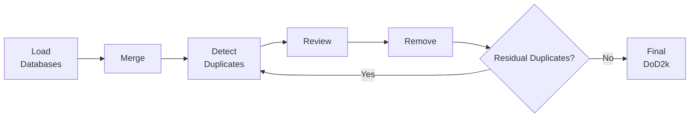

# **Generate DoD2k from scratch**


This tutorial guides you through the complete end-to-end workflow to recreate the DoD2k database from original source data.


## Complete Workflow Summary

    



!!! warning "Time Investment"
    Recreating DoD2k from scratch is a substantial undertaking. Consider using the pre-built DoD2k v2.0 for most applications.

--------

## Step 1: Load the input databases from source

Load each database using the interactive notebooks in `dod2k/notebooks/`. Each notebook is named `load_DB.ipynb` for database `DB`.


??? info  "Load PAGES 2k data from source"

    **Notebook:** [load_pages2k.ipynb](../notebooks/load_pages2k.ipynb)
    
    This notebook loads PAGES 2k data from LiPDverse (currently version 2.2.0) and creates a standardised compact dataframe.

    Download the data from source:
    
    ```python title='python3/Jupyter'
    # Download the file
    
    !wget -O data/pages2k/Pages2kTemperature2_2_0.pkl https://lipdverse.org/Pages2kTemperature/current_version/Pages2kTemperature2_2_0.pkl
    ```
    
    This will download the pickle file `Pages2kTemperature2_2_0.pkl` into `data/pages2k`.

    Subsequently, run the interactive notebook to create a set of `csv` files containing the compact dataframe.


??? info "Load FE23 data from source"
    
     **Notebook:** [load_fe23.ipynb](../notebooks/load_fe23.ipynb)
    
    This notebook loads FE23 from NCEI and creates a standardised compact dataframe.

    Download the data from source:
    
    ```python title='python3/Jupyter'
    # download and unzip FE23 
    !wget -O /data/fe23/franke2022-fe23.nc https://www.ncei.noaa.gov/pub/data/paleo/contributions_by_author/franke2022/franke2022-fe23.nc
    fe23_full  = xr.open_dataset('fe23/franke2022-fe23.nc')
    
    # save slice of FE23 with only relevant variables as netCDF (fe23_full is 25GB)
    fe23_slice = fe23_full[vars]
    fe23_slice.to_netcdf('data/fe23/franke2022-fe23_slice.nc')
    ```
    
    This will download the netCDF file `franke2022-fe23.nc` into `data/fe23`. 
    !!! warning "Large Dataset"
        `franke2022-fe23.nc` is a very large dataset (~25GB). Consider using the slice provided in data/fe23/franke2022-fe23_slice.nc which contains only the desired variables.


    Subsequently, run the interactive notebook to create a set of `csv` files containing the compact dataframe.


??? info "Load Iso2k data from source"

     **Notebook:** [load_iso2k.ipynb](../notebooks/load_iso2k.ipynb)
    
    This notebook loads Iso2k (v1.1.2) from LiPDverse and creates a standardised compact dataframe.

    In order to load the data from source please activate the following cell:
    
    ```python title='python3/Jupyter'
    # Download the file (use -O to specify output filename)
    !wget -O data/iso2k/iso2k1_1_2.zip https://lipdverse.org/iso2k/current_version/iso2k1_1_2.zip
    
    # Unzip to the correct destination
    !unzip data/iso2k/iso2k1_1_2.zip -d data/iso2k/iso2k1_1_2
    ```
    
    This will download the zip file `iso2k1_1_2.zip` into `data/iso2k` and unzip into the directory `data/iso2k/iso2k1_1_2`.

    Subsequently, run the interactive notebook to create a set of `csv` files containing the compact dataframe.


??? info "Load SISAL data from source"


    **Notebook:** [load_sisal.ipynb](../notebooks/load_sisal.ipynb)
    
    Download a set of CSV files from [ORA](https://ora.ox.ac.uk/objects/uuid:1e91e2ac-ca9f-46e5-85f3-8d82d4d3cfd4) and run the notebook to create a standardised compact dataframe.
    


??? info "Load CoralHydro2k data from source"


    **Notebook:** [load_ch2k.ipynb](../notebooks/load_ch2k.ipynb)
    
    This notebook loads CoralHydro2k from LiPDverse and creates a standardised compact dataframe.
    
    Download and extract the data:
    
    ```python title='python3/Jupyter'
    # Download the file (use -O to specify output filename)
    !wget -O data/ch2k/CoralHydro2k1_0_1.zip https://lipdverse.org/CoralHydro2k/current_version/CoralHydro2k1_0_1.zip
    
    # Unzip to the correct destination
    !unzip data/ch2k/CoralHydro2k1_0_1.zip -d data/ch2k/ch2k_101
    ```
    
    This will download the zip file `CoralHydro2k1_0_1.zip` into `data/ch2k` and unzip into the directory `data/ch2k/ch2k_101`.

    Subsequently, run the interactive notebook to create a set of `csv` files containing the compact dataframe.

!!! tip "See Also"

    For detailed information on the loading process, see [Loading & Merging Databases](load_merge.md).

--------

## Step 2: Merge the databases


**Notebook:** [merge_databases.ipynb](../notebooks/merge_databases.ipynb)

After running all the load notebooks, the next step is to merge the standardised compact dataframes into a single database.

Before merging the databases, make sure that all the databases are included by defining

```python title='python3/Jupyter'
dataset_names = ['pages2k', 'fe23', 'ch2k', 'iso2k', 'sisal' ]
```

The merged compact dataframe is saved in `data/all_merged/`.

!!! tip "See Also"
    For detailed merging instructions, see [Loading & Merging Databases](load_merge.md).


##Step 3: Run the duplicate detection workflow

The merged dataset must go through the three-step duplicate workflow.

In the duplicate workflow, potential duplicate candidates are first flagged. While some duplicates are obviously identical, in which case one of the records is automatically removed, a number of duplicates require expert decisions. The operator then has to go through these candidate pairs and manually inspect the potential duplicates and make a decision for each of those pairs. 
Ultimately, the decisions are implemented and the identified duplicates are removed from the dataset. 

!!! tip "See Also"
    For complete details on the duplicate detection workflow, see [Duplicate Detection Tutorial](duplicate.md).


--------


### 3.1 Duplicate detection

**Notebook:** [dup_detection.ipynb](../notebooks/dup_detection.ipynb)

    
Set up the environment and load the merged dataset:
```python title='python3/Jupter'
db_name='all_merged' 
df = utf.load_compact_dataframe_from_csv(db_name)
df.name = db_name
```

!!! warning "Important"
    Make sure to set `df.name = db_name` for proper output tagging.

Run the duplicate detection algorithm:
```python title='python3/Jupyter'
dup.find_duplicates_optimized(df, n_points_thresh=10)
```

**Output:** `data/all_merged/dup_detection/dup_detection_candidates_all_merged.csv`


??? tip "Run as Script for Large Databases"

    The duplicate detection algorithm does not require any user input. It can therefore be easier to convert the interactive notebook to a python script and run it from the command line. Do this by
    ```python title='python3/Jupyter'
    cd ~/dod2k_v2.0/dod2k
    mkdir -p scripts
    jupyter nbconvert --to python notebooks/dup_detection.ipynb --stdout | \
    sed 's/^get_ipython()/# get_ipython()/' | \
    sed 's/^\([[:space:]]*\)%/\1# %/' > scripts/dup_detection.py
    ```
    and subsequently 
    ```python title='python3/Jupyter'
    python scripts/dup_detection.py
    ```

    
--------

### 3.2 Duplicate decisions
**Notebook:** [dup_decision.ipynb](../notebooks/dup_decision.ipynb)

This step requires operator input to classify detected duplicate candidates.

**Initialization:**

1. Set up environment (see Section 1.1 of [Duplicate Detection Tutorial](duplicate.md))
2. Load the merged dataframe (see Section 1.2)
3. Provide operator credentials:
```python title='python3/Jupyter'
initials = 'FN'
fullname = 'Full Name'
email = 'name@email.ac.uk'
operator_details = [initials, fullname, email]
```

**Automate recurrent decisions**, using the default hierarchy and an additional automated preference criterion for specific database combinations:
```python title='python3/Jupyter'
# implement hierarchy for automated decisions for identical records

df = dup.define_hierarchy(df, hierarchy='default')
```


```python title='python3/Jupyter'
# automate database choice for specific database cominations
automate_db_choice = {'preferred_db': 'FE23 (Breitenmoser et al. (2014))', 
                      'rejected_db': 'PAGES 2k v2.2.0', 
                      'reason': 'conservative replication requirement'}
```


**Run the decision process:**
```python title='python3/Jupyter'
dup.duplicate_decisions_multiple(df, operator_details=operator_details, choose_recollection=True, 
                                 remove_identicals=True, backup=True, comment=True, automate_db_choice=automate_db_choice)
```
**Output:** `data/all_merged/dup_detection/dup_decisions_all_merged_INITIALS_DATE.csv`

For each candidate pair, the operator decides to:

- Keep both records
- Keep one record only
- Delete both records
- Create a composite

!!! note "Automated vs Manual Decisions"
    - **Automated:** Identical duplicates are handled based on hierarchy
    - **Manual:** Ambiguous cases require operator review with summary figures

!! tip "Backup & Resume Functionality"

    The decision process automatically creates backup files in `data/all_merged/dup_detection/`. If your session is interrupted, you can restart the process and it will resume from where the backup left off. This is especially useful for large databases with hundreds of duplicate pairs.

--------

### 3.3 Remove Duplicates

**Notebook:** [dup_removal.ipynb](../notebooks/dup_removal.ipynb)

Implement the decisions to create the final duplicate-free database.

**Setup:**
```python title='python3/Jupyter'
# Set index
df.set_index('datasetId', inplace = True)
df['datasetId']=df.index

# Load decisions (specify your initials and date)
filename = f'data/{df.name}/dup_detection/dup_decisions_{df.name}_{initials}_{date}'
data, header = dup.read_csv(filename, header=True)
df_decisions = pd.read_csv(filename+'.csv', header=5)

# Collect decisions for each record
decisions = dup.collect_record_decisions(df_decisions)

# Collect duplicate details for each record
dup_details = dup.collect_dup_details(df_decisions, header)
```

**Implementation workflow:**

The notebook processes duplicates in four steps:

1. **Remove duplicate record**: All records flagged for removal or compositing are saved in `df_duplica` (for inspection) and dropped from the cleaned dataframe `df_cleaned`
    
    ```python title='python3/Jupyter'
    # load the records TO BE REMOVED OR COMPOSITED
    remove_IDs  = list(df_decisions['datasetId 1'][np.isin(df_decisions['Decision 1'],['REMOVE', 'COMPOSITE'])])
    remove_IDs += list(df_decisions['datasetId 2'][np.isin(df_decisions['Decision 2'],['REMOVE', 'COMPOSITE'])])
    remove_IDs  = np.unique(remove_IDs)
    
    df_duplica =  df.loc[remove_IDs, 'datasetId'] # df containing only records which were removed
    df_cleaned =  df.drop(remove_IDs) # df freed from 'REMOVE' type duplicates

    # also add columns on decision process to df_cleaned:
    df_cleaned['duplicateDetails']='N/A'
    for ID in dup_details:
        if ID in df_cleaned.index: 
            if df_cleaned.at[ID, 'duplicateDetails']=='N/A': 
                df_cleaned.at[ID, 'duplicateDetails']=dup_details[ID]
            else: df_cleaned.at[ID, 'duplicateDetails']+=dup_details[ID]
    ```
   
2. **Create composites**: Records marked as `COMPOSITE` are averaged (z-scores for data values, means for coordinates) and given new composite IDs. Summary figures are generated for quality control.

    
    ```python title='python3/Jupyter'
    # load the records to be composited
    comp_ID_pairs = df_decisions[(df_decisions['Decision 1']=='COMPOSITE')&(df_decisions['Decision 2']=='COMPOSITE')]
    
    # create new composite data and metadata from the pairs
    # loop through the composite pairs and check metadata
    df_composite = dup.join_composites_metadata(df, comp_ID_pairs, df_decisions, header)
    ```

3. **Join and check for overlapping decisions**: The duplicate free dataframe is obtained by joining 
- `df_cleaned` (duplicate free as all records with decision `REMOVE` and/or `COMPOSITE` removed) and
- `df_composite` (dupicate free as duplicates are composited)

```python title='python3/Jupyter'

    tmp_df_dupfree = pd.concat([df_cleaned, df_composite])
    tmp_df_dupfree.index = tmp_df_dupfree['datasetId']
```

!!! info 'Remove remaining multiple duplicates' 

    There might still be duplicates between the two dataframes: when a record has been associated with more than 1 duplicate candidate pair. Therefore, we loop through the records in the joined dataframe which have been associated with multiple duplicates.

    ```python title='python3/Jupyter'
    # initiate the loop
    tmp_df_dupfree = pd.concat([df_cleaned, df_composite])
    tmp_df_dupfree.index = tmp_df_dupfree['datasetId']
    tmp_decisions = decisions.copy()
    
    composite_log = []
    for ii in range(10): 
        tmp_df_dupfree.set_index('datasetId', inplace = True)
        tmp_df_dupfree['datasetId']=tmp_df_dupfree.index
        
        print('-'*20)
        print(f'ITERATION # {ii}')
        
        multiple_dups = []
        for id in tmp_decisions.keys():
            if len(tmp_decisions[id]) > 1:
                if id not in multiple_dups:
                    multiple_dups.append(id)
        
        if len(multiple_dups) > 0:
            # Check which of the multiple duplicate IDs are still in the dataframe
            multiple_dups_new = []
            current_ids = set(tmp_df_dupfree.index)  # Get all current IDs as a set
            
            for id in multiple_dups:
                if id in current_ids:  # Simple membership check
                    multiple_dups_new.append(id)
            
            if len(multiple_dups_new) > 0:
                print(f'WARNING! Decisions associated with {len(multiple_dups_new)} multiple duplicates in the new dataframe.')
                print('Please review these records below and run through a further duplicate detection workflow until no more duplicates are found.')
            else:
                print('No more multiple duplicates found in current dataframe.')
                print('SUCCESS!!')
                break
        else:
            print('No more multiple duplicates.')
            print('SUCCESS!!')
            break
        
        # Now we create a small dataframe which needs to be checked for duplicates.
        df_check = tmp_df_dupfree.copy()[np.isin(tmp_df_dupfree['datasetId'], multiple_dups_new)]
        print('Check dataframe: ')
        df_check.name = 'tmp'
        df_check.index = range(len(df_check))
        print(df_check.info())
        # We then run a brief duplicate detection algorithm on the dataframe. Note that by default the composited data has the highest value in the hierarchy.
        pot_dup_IDs = dup.find_duplicates_optimized(df_check, n_points_thresh=10, return_data=True)
        if len(pot_dup_IDs)==0:
            print('SUCCESS!! NO MORE DUPLICATES DETECTED!!')
            break
        else:
            yn=''
            while yn not in ['y', 'n']:
                yn = input('Do you want to continue with the decision process for duplicates? [y/n]')
            if yn=='n': break
        
        df_check = dup.define_hierarchy(df_check)
        dup.duplicate_decisions_multiple(df_check, operator_details=operator_details, choose_recollection=True, 
                                remove_identicals=False, backup=False, comment=False)
        # implement the decisions
        tmp_df_decisions  = pd.read_csv(f'data/{df_check.name}/dup_detection/dup_decisions_{df_check.name}_{initials}_{date}'+'.csv', header=5)
        tmp_dup_details   = dup.provide_dup_details(tmp_df_decisions, header)
    
        
        # decisions
        tmp_decisions = {}
        for ind in tmp_df_decisions.index:
            id1, id2   = tmp_df_decisions.loc[ind, ['datasetId 1', 'datasetId 2']]
            dec1, dec2 = tmp_df_decisions.loc[ind, ['Decision 1', 'Decision 2']]
            for id, dec in zip([id1, id2], [dec1, dec2]):
                if id not in tmp_decisions: tmp_decisions[id] = []
                tmp_decisions[id]+=[dec]
        
        df_check.set_index('datasetId', inplace = True)
        df_check['datasetId']=df_check.index
        
        #drop all REMOVE or COMPOSITE types
        tmp_remove_IDs  = list(tmp_df_decisions['datasetId 1'][np.isin(tmp_df_decisions['Decision 1'],['REMOVE', 'COMPOSITE'])])
        tmp_remove_IDs += list(tmp_df_decisions['datasetId 2'][np.isin(tmp_df_decisions['Decision 2'],['REMOVE', 'COMPOSITE'])])
        tmp_remove_IDs = np.unique(tmp_remove_IDs)#[id for id in np.unique(tmp_remove_IDs) if id not in tmp_remove_IDs]
        tmp_df_cleaned = tmp_df_dupfree.drop(tmp_remove_IDs) # df freed from 'REMOVE' type duplicates
        
        # # composite the 
        tmp_comp_ID_pairs = tmp_df_decisions[(tmp_df_decisions['Decision 1']=='COMPOSITE')&(tmp_df_decisions['Decision 2']=='COMPOSITE')]
        
        if len(tmp_comp_ID_pairs) > 0:
            for _, pair in tmp_comp_ID_pairs.iterrows():
                id1, id2 = pair['datasetId 1'], pair['datasetId 2']
                # Log what was composited
                composite_log.append({
                    'iteration': ii,
                    'composited': [id1, id2],
                    'new_id': f"{id1}_{id2}_composite"  # or however you generate it
                })
        # # create new composite data and metadata from the pairs
        # # loop through the composite pairs and check metadata
        tmp_df_composite = dup.join_composites_metadata(df_check, tmp_comp_ID_pairs, tmp_df_decisions, header)
    
        tmp_df_dupfree = pd.concat([tmp_df_cleaned, tmp_df_composite])
        print('--'*20)
        print('Finished iteration.')
        
        print('NEW DATAFRAME:')
        print(tmp_df_dupfree.info())
    
        print('--'*20)
        print('--'*20)
        if ii==19: print('STILL DUPLICATES PRESENT AFTER MULTIPLE ITERATIONS! REVISE DECISION PROCESS!!')
    
        print('--'*20)
    
    print(f"Created {len(composite_log)} composites across all iterations")
    
    ```

4. **Check again for remaining duplicates in the entire dataframe**: The resulting dataframe should be checked once more for resulting duplicates. This can be dome by setting up a loop of the duplicate workflow until no more duplicates are found:

```python title='python3/Jupyter'
    tmp_df_dupfree.set_index('datasetId', inplace = True)
    tmp_df_dupfree['datasetId']=tmp_df_dupfree.index
    
    # Now we create a  dataframe which needs to be checked for duplicates.
    df_check = tmp_df_dupfree.copy()
    df_check.name = 'tmp'
    df_check.index = range(len(df_check))
    # We then run a brief duplicate detection algorithm on the dataframe. Note that by default the composited data has the highest value in the hierarchy.
    pot_dup_IDs = dup.find_duplicates_optimized(df_check, n_points_thresh=10, return_data=True)
    if len(pot_dup_IDs)==0:
        print('SUCCESS!! NO MORE DUPLICATES DETECTED!!')
    else:
        df_check = dup.define_hierarchy(df_check)
        dup.duplicate_decisions_multiple(df_check, operator_details=operator_details, choose_recollection=True, 
                                remove_identicals=False, backup=False)
        # implement the decisions
        tmp_df_decisions  = pd.read_csv(f'data/{df_check.name}/dup_detection/dup_decisions_{df_check.name}_{initials}_{date}'+'.csv', header=5)
        tmp_dup_details   = dup.provide_dup_details(tmp_df_decisions, header)
        
        
        # decisions
        tmp_decisions = {}
        for ind in tmp_df_decisions.index:
            id1, id2   = tmp_df_decisions.loc[ind, ['datasetId 1', 'datasetId 2']]
            dec1, dec2 = tmp_df_decisions.loc[ind, ['Decision 1', 'Decision 2']]
            for id, dec in zip([id1, id2], [dec1, dec2]):
                if id not in tmp_decisions: tmp_decisions[id] = []
                tmp_decisions[id]+=[dec]
        
        df_check.set_index('datasetId', inplace = True)
        df_check['datasetId']=df_check.index
        
        #drop all REMOVE or COMPOSITE types
        tmp_remove_IDs  = list(tmp_df_decisions['datasetId 1'][np.isin(tmp_df_decisions['Decision 1'],['REMOVE', 'COMPOSITE'])])
        tmp_remove_IDs += list(tmp_df_decisions['datasetId 2'][np.isin(tmp_df_decisions['Decision 2'],['REMOVE', 'COMPOSITE'])])
        tmp_remove_IDs = np.unique(tmp_remove_IDs)#[id for id in np.unique(tmp_remove_IDs) if id not in tmp_remove_IDs]
        tmp_df_cleaned = tmp_df_dupfree.drop(tmp_remove_IDs) # df freed from 'REMOVE' type duplicates
        
        # # composite the 
        tmp_comp_ID_pairs = tmp_df_decisions[(tmp_df_decisions['Decision 1']=='COMPOSITE')&(tmp_df_decisions['Decision 2']=='COMPOSITE')]
        
        # # create new composite data and metadata from the pairs
        # # loop through the composite pairs and check metadata
        tmp_df_composite = dup.join_composites_metadata(df_check, tmp_comp_ID_pairs, tmp_df_decisions, header)
        
        tmp_df_dupfree = pd.concat([tmp_df_cleaned, tmp_df_composite])
        
        print('Finished last round of duplicate removal.')
        print('Potentially run through this cell again to check for remaining duplicates.')
          
```

!!! warning

    This process once again goes, at least once, through the entire duplicate detection, decision and removal workflow and might therefore take a considerable amount of time. 


!!! info "Detailed Instructions"
    For complete step-by-step code and explanations, see Section 3.3 of the [Duplicate Detection Tutorial](duplicate.md#33-implement-duplicate-decisions).

**Save the duplicate-free database:**
```python title='python3/Jupyter'
    df_dupfree = df_dupfree[sorted(df_dupfree.columns)]
    df_dupfree.name =f'{df.name}_{initials}_{date}_dupfree'
    
    os.makedirs(f'data/{df_dupfree.name}/', exist_ok=True)

    # save to a list of csv files (metadata, data, year)
    utf.write_compact_dataframe_to_csv(df_dupfree)
```

**Output:** Duplicate-free database saved in `data/all_merged_INITIALS_DATE_dupfree/`

!!! success "Duplicate Detection Complete"
    The database is now free of duplicates and ready for analysis.

<!-- ### 3.3 Remove Duplicates

**Notebook:** [dup_removal.ipynb](../notebooks/dup_removal.ipynb)

Implement the decisions to create the final duplicate-free database.

**Setup:**
```python title='python3/Jupyter'
# Set index
df.set_index('datasetId', inplace=True)
df['datasetId'] = df.index

# Load decisions (specify your initials and date)
filename = f'data/{df.name}/dup_detection/dup_decisions_{df.name}_{initials}_{date}'
data, header = dup.read_csv(filename, header=True)
df_decisions = pd.read_csv(filename+'.csv', header=5)
```

**Implement decisions and create duplicate-free dataframe:**

The notebook will:

1. Remove records marked as `REMOVE`
2. Create composites for records marked as `COMPOSITE`
3. Check for overlapping decisions
4. Merge results into final dataframe

!!! warning "Multiple Duplicates Handling - Under Construction"
    The automated screening for records with multiple conflicting duplicate decisions (e.g., both `REMOVE` and `COMPOSITE`) is currently under development. For now, such cases should be manually reviewed if they occur.


**Save the duplicate-free database:**
```python title='python3/Jupyter'
df_dupfree = pd.concat([df_dupfree_rmv, df_composite])
df_dupfree = df_dupfree[sorted(df_dupfree.columns)]
df_dupfree.name = f'{df.name}_{initials}_{date}_dupfree'

# Create output directory
os.makedirs(f'data/{df_dupfree.name}/', exist_ok=True)

# Save to pickle
df_dupfree.to_pickle(f'data/{df_dupfree.name}/{df_dupfree.name}_compact.pkl')

# Save to CSV files
utf.write_compact_dataframe_to_csv(df_dupfree)

# Save metadata
file = open(f'data/{df_dupfree.name}/{df_dupfree.name}_dupfree_README.txt', 'w')
for line in header:
    file.write(line+'\n')
file.close()
```

**Output:** Duplicate-free database saved in `data/all_merged_INITIALS_DATE_dupfree/` -->

<!-- ---

## Step 4: Rerun Duplicate Detection (Optional)

After creating the initial duplicate-free database, you may want to verify no residual duplicates remain.

**Load the duplicate-free database:**
```python title='python3/Jupyter'
db_name = 'all_merged_INITIALS_DATE_dupfree'  # Use your actual filename
df = utf.load_compact_dataframe_from_csv(db_name)
df.name = db_name
```

**Rerun detection:**
```python title='python3/Jupyter'
dup.find_duplicates_optimized(df, n_points_thresh=10)
```

If additional duplicates are found, repeat Steps 3.2 and 3.3. This creates a `dupfree_dupfree` database, ensuring thoroughness.
 -->
 <!-- 
!!! success "Duplicate Detection Complete"
    The database is now free of duplicates and ready for analysis. 

 -->
<!-- ## Step 5: Load and Visualize the Final Database

**Notebook:** [df_info.ipynb](../notebooks/df_info.ipynb) and [df_plot_dod2k.ipynb](../notebooks/df_plot_dod2k.ipynb)

Load your final DoD2k database:
```python title='python3/Jupyter'
db_name = 'all_merged_INITIALS_DATE_dupfree'
df = utf.load_compact_dataframe_from_csv(db_name)
```

**Explore the database:**

- View summary statistics and metadata
- Create spatial distribution maps
- Plot proxy records and time coverage
- Filter by archive type, location, or time period

!!! tip "See Also"
    For detailed visualization and analysis workflows, see [Loading & Visualizing DoD2k](use_dod2k.md).
 -->
---


---

## Related Tutorials

- [Loading & Merging Databases](load_merge.md) - Detailed instructions for Steps 1-2
- [Duplicate Detection](duplicate.md) - Complete duplicate workflow documentation
- [Loading & Visualizing DoD2k](use_dod2k.md) - Working with the final database