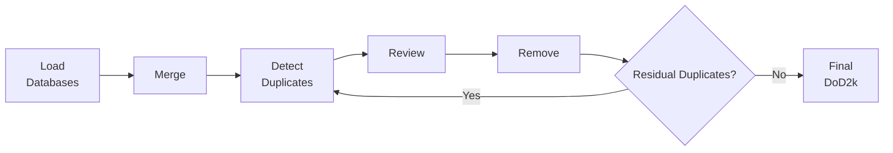

# **Generate DoD2k from scratch**


This tutorial guides you through the complete end-to-end workflow to recreate the DoD2k database from original source data.


## Complete Workflow Summary

    



!!! warning "Time Investment"
    Recreating DoD2k from scratch is a substantial undertaking. Consider using the pre-built DoD2k v2.0 for most applications.

## Step 1: Load the input databases from source

Load each database using the interactive notebooks in `dod2k/notebooks/`. Each notebook is named `load_DB.ipynb` for database `DB`.


??? info  "Load PAGES 2k data from source"

    **Notebook:** [load_pages2k.ipynb](../notebooks/load_pages2k.ipynb)
    
    This notebook loads PAGES 2k data from LiPDverse (currently version 2.2.0) and creates a standardised compact dataframe.

    Download the data from source:
    
    ```python title='python3/Jupyter'
    # Download the file
    
    !wget -O data/pages2k/Pages2kTemperature2_2_0.pkl https://lipdverse.org/Pages2kTemperature/current_version/Pages2kTemperature2_2_0.pkl
    ```
    
    This will download the pickle file `Pages2kTemperature2_2_0.pkl` into `data/pages2k`.

    Subsequently, run the interactive notebook to create a set of `csv` files containing the compact dataframe.


??? info "Load FE23 data from source"
    
     **Notebook:** [load_fe23.ipynb](../notebooks/load_fe23.ipynb)
    
    This notebook loads FE23 from NCEI and creates a standardised compact dataframe.

    Download the data from source:
    
    ```python title='python3/Jupyter'
    # download and unzip FE23 
    !wget -O /data/fe23/franke2022-fe23.nc https://www.ncei.noaa.gov/pub/data/paleo/contributions_by_author/franke2022/franke2022-fe23.nc
    fe23_full  = xr.open_dataset('fe23/franke2022-fe23.nc')
    
    # save slice of FE23 with only relevant variables as netCDF (fe23_full is 25GB)
    fe23_slice = fe23_full[vars]
    fe23_slice.to_netcdf('data/fe23/franke2022-fe23_slice.nc')
    ```
    
    This will download the netCDF file `franke2022-fe23.nc` into `data/fe23`. 
    !!! warning "Large Dataset"
        `franke2022-fe23.nc` is a very large dataset (~25GB). Consider using the slice provided in data/fe23/franke2022-fe23_slice.nc which contains only the desired variables.


    Subsequently, run the interactive notebook to create a set of `csv` files containing the compact dataframe.


??? info "Load Iso2k data from source"

     **Notebook:** [load_iso2k.ipynb](../notebooks/load_iso2k.ipynb)
    
    This notebook loads Iso2k (v1.1.2) from LiPDverse and creates a standardised compact dataframe.

    In order to load the data from source please activate the following cell:
    
    ```python title='python3/Jupyter'
    # Download the file (use -O to specify output filename)
    !wget -O data/iso2k/iso2k1_1_2.zip https://lipdverse.org/iso2k/current_version/iso2k1_1_2.zip
    
    # Unzip to the correct destination
    !unzip data/iso2k/iso2k1_1_2.zip -d data/iso2k/iso2k1_1_2
    ```
    
    This will download the zip file `iso2k1_1_2.zip` into `data/iso2k` and unzip into the directory `data/iso2k/iso2k1_1_2`.

    Subsequently, run the interactive notebook to create a set of `csv` files containing the compact dataframe.


??? info "Load SISAL data from source"


    **Notebook:** [load_sisal.ipynb](../notebooks/load_sisal.ipynb)
    
    Download a set of CSV files from [ORA](https://ora.ox.ac.uk/objects/uuid:1e91e2ac-ca9f-46e5-85f3-8d82d4d3cfd4) and run the notebook to create a standardised compact dataframe.
    


??? info "Load CoralHydro2k data from source"


    **Notebook:** [load_ch2k.ipynb](../notebooks/load_ch2k.ipynb)
    
    This notebook loads CoralHydro2k from LiPDverse and creates a standardised compact dataframe.
    
    Download and extract the data:
    
    ```python title='python3/Jupyter'
    # Download the file (use -O to specify output filename)
    !wget -O data/ch2k/CoralHydro2k1_0_1.zip https://lipdverse.org/CoralHydro2k/current_version/CoralHydro2k1_0_1.zip
    
    # Unzip to the correct destination
    !unzip data/ch2k/CoralHydro2k1_0_1.zip -d data/ch2k/ch2k_101
    ```
    
    This will download the zip file `CoralHydro2k1_0_1.zip` into `data/ch2k` and unzip into the directory `data/ch2k/ch2k_101`.

    Subsequently, run the interactive notebook to create a set of `csv` files containing the compact dataframe.

!!! tip "See Also"

    For detailed information on the loading process, see [Loading & Merging Databases](load_merge.md).


## Step 2: Merge the databases


**Notebook:** [merge_databases.ipynb](../notebooks/merge_databases.ipynb)

After running all the load notebooks, the next step is to merge the standardised compact dataframes into a single database.

Before merging the databases, make sure that all the databases are included by defining

```python title='python3/Jupyter'
dataset_names = ['pages2k', 'fe23', 'ch2k', 'iso2k', 'sisal' ]
```

The merged compact dataframe is saved in `data/all_merged/`.

!!! tip "See Also"
    For detailed merging instructions, see [Loading & Merging Databases](load_merge.md).


##Step 3: Run the duplicate detection workflow

The merged dataset must go through the three-step duplicate workflow.

In the duplicate workflow, potential duplicate candidates are first flagged. While some duplicates are obviously identical, in which case one of the records is automatically removed, a number of duplicates require expert decisions. The operator then has to go through these candidate pairs and manually inspect the potential duplicates and make a decision for each of those pairs. 
Ultimately, the decisions are implemented and the identified duplicates are removed from the dataset. 

!!! tip "See Also"
    For complete details on the duplicate detection workflow, see [Duplicate Detection Tutorial](duplicate.md).


### 3.1 Duplicate detection

**Notebook:** [dup_detection.ipynb](../notebooks/dup_detection.ipynb)

    
Set up the environment and load the merged dataset:
```python title='python3/Jupter'
db_name='all_merged' 
df = utf.load_compact_dataframe_from_csv(db_name)
df.name = db_name
```

!!! warning "Important"
    Make sure to set `df.name = db_name` for proper output tagging.

Run the duplicate detection algorithm:
```python title='python3/Jupyter'
dup.find_duplicates_optimized(df, n_points_thresh=10)
```

**Output:** `data/all_merged/dup_detection/dup_detection_candidates_all_merged.csv`


??? tip "Run as Script for Large Databases"

    The duplicate detection algorithm does not require any user input. It can therefore be easier to convert the interactive notebook to a python script and run it from the command line. Do this by
    ```python title='python3/Jupyter'
    cd ~/dod2k_v2.0/dod2k
    mkdir -p scripts
    jupyter nbconvert --to python notebooks/dup_detection.ipynb --stdout | \
    sed 's/^get_ipython()/# get_ipython()/' | \
    sed 's/^\([[:space:]]*\)%/\1# %/' > scripts/dup_detection.py
    ```
    and subsequently 
    ```python title='python3/Jupyter'
    python scripts/dup_detection.py
    ```

    

### 3.2 Duplicate decisions
**Notebook:** [dup_decision.ipynb](../notebooks/dup_decision.ipynb)

This step requires operator input to classify detected duplicate candidates.

**Initialization:**

1. Set up environment (see Section 1.1 of [Duplicate Detection Tutorial](duplicate.md))
2. Load the merged dataframe (see Section 1.2)
3. Provide operator credentials:
```python title='python3/Jupyter'
initials = 'FN'
fullname = 'Full Name'
email = 'name@email.ac.uk'
operator_details = [initials, fullname, email]
```

**Define database hierarchy** for automated decisions:
```python title='python3/Jupyter'
df['Hierarchy'] = 0 
df.loc[df['originalDatabase']=='PAGES2k v2.2.0', 'Hierarchy'] = 5
df.loc[df['originalDatabase']=='FE23 (Breitenmoser et al. (2014))', 'Hierarchy'] = 4
df.loc[df['originalDatabase']=='Iso2k v1.1.2', 'Hierarchy'] = 3
df.loc[df['originalDatabase']=='CoralHydro2k v1.0.1', 'Hierarchy'] = 2
df.loc[df['originalDatabase']=='SISAL v3', 'Hierarchy'] = 1
```

**Run the decision process:**
```python title='python3/Jupyter'
dup.duplicate_decisions(df, operator_details=operator_details, 
                        choose_recollection=True, remove_identicals=True)
```
**Output:** `data/all_merged/dup_detection/dup_decisions_all_merged_INITIALS_DATE.csv`

For each candidate pair, the operator decides to:

- Keep both records
- Keep one record only
- Delete both records
- Create a composite

!!! note "Automated vs Manual Decisions"
    - **Automated:** Identical duplicates are handled based on hierarchy
    - **Manual:** Ambiguous cases require operator review with summary figures

!! tip "Backup & Resume Functionality"
    The decision process automatically creates backup files in `data/all_merged/dup_detection/`. If your session is interrupted, you can restart the process and it will resume from where the backup left off. This is especially useful for large databases with hundreds of duplicate pairs.


### 3.3 Remove Duplicates

**Notebook:** [dup_removal.ipynb](../notebooks/dup_removal.ipynb)

Implement the decisions to create the final duplicate-free database.

**Setup:**
```python title='python3/Jupyter'
# Set index
df.set_index('datasetId', inplace=True)
df['datasetId'] = df.index

# Load decisions (specify your initials and date)
filename = f'data/{df.name}/dup_detection/dup_decisions_{df.name}_{initials}_{date}'
data, header = dup.read_csv(filename, header=True)
df_decisions = pd.read_csv(filename+'.csv', header=5)
```

**Implementation workflow:**

The notebook processes duplicates in four steps:

1. **Remove records marked as `REMOVE`** - All records flagged for removal are separated into `df_duplica_rmv` (for inspection) and dropped from the working dataframe `df_dupfree_rmv`
    
    ```python title='python3/Jupyter'
    # load the records TO BE REMOVED
    remove_IDs  = list(df_decisions['datasetId 1'][np.isin(df_decisions['Decision 1'],['REMOVE', 'COMPOSITE'])])
    remove_IDs += list(df_decisions['datasetId 2'][np.isin(df_decisions['Decision 2'],['REMOVE', 'COMPOSITE'])])
    remove_IDs  = np.unique(remove_IDs)
    
    df_dupfree_rmv = df.drop(remove_IDs) # df freed from 'REMOVE' type duplicates
    
    ```
   
2. **Create composites** - Records marked as `COMPOSITE` are averaged (z-scores for data values, means for coordinates) and given new composite IDs. Summary figures are generated for quality control.

    
    ```python title='python3/Jupyter'
    # load the records to be composited
    comp_ID_pairs = df_decisions[(df_decisions['Decision 1']=='COMPOSITE')&(df_decisions['Decision 2']=='COMPOSITE')]
    
    # create new composite data and metadata from the pairs
    df_composite = dup.join_composites_metadata(df, comp_ID_pairs, df_decisions, header)
    ```

3. **Check for overlapping decisions** - The algorithm identifies any records with conflicting decisions (e.g., both `REMOVE` and `COMPOSITE` from different duplicate pairs)

    !!! warning "Multiple Duplicates Handling - Under Construction"
   
        Automated screening for records with multiple conflicting duplicate decisions is currently under development. Such cases should be manually reviewed if they occur.

5. **Merge results** - Cleaned records (`df_dupfree_rmv`) and composites (`df_composite`) are combined into the final duplicate-free database

    ```python title='python3/Jupyter'
    df_dupfree = pd.concat([tmp_df_dupfree_rmv, tmp_df_composite])
    ```


!!! info "Detailed Instructions"
    For complete step-by-step code and explanations, see Section 3.3 of the [Duplicate Detection Tutorial](duplicate.md#33-implement-duplicate-decisions).

**Save the duplicate-free database:**
```python title='python3/Jupyter'
df_dupfree = pd.concat([df_dupfree_rmv, df_composite])
df_dupfree.name = f'{df.name}_{initials}_{date}_dupfree'

# Create output directory
os.makedirs(f'data/{df_dupfree.name}/', exist_ok=True)

# Save files
df_dupfree.to_pickle(f'data/{df_dupfree.name}/{df_dupfree.name}_compact.pkl')
utf.write_compact_dataframe_to_csv(df_dupfree)

# Save metadata README
file = open(f'data/{df_dupfree.name}/{df_dupfree.name}_dupfree_README.txt', 'w')
for line in header:
    file.write(line+'\n')
file.close()
```

**Output:** Duplicate-free database saved in `data/all_merged_INITIALS_DATE_dupfree/`

!!! success "Duplicate Detection Complete"
    The database is now free of duplicates and ready for analysis.

<!-- ### 3.3 Remove Duplicates

**Notebook:** [dup_removal.ipynb](../notebooks/dup_removal.ipynb)

Implement the decisions to create the final duplicate-free database.

**Setup:**
```python title='python3/Jupyter'
# Set index
df.set_index('datasetId', inplace=True)
df['datasetId'] = df.index

# Load decisions (specify your initials and date)
filename = f'data/{df.name}/dup_detection/dup_decisions_{df.name}_{initials}_{date}'
data, header = dup.read_csv(filename, header=True)
df_decisions = pd.read_csv(filename+'.csv', header=5)
```

**Implement decisions and create duplicate-free dataframe:**

The notebook will:

1. Remove records marked as `REMOVE`
2. Create composites for records marked as `COMPOSITE`
3. Check for overlapping decisions
4. Merge results into final dataframe

!!! warning "Multiple Duplicates Handling - Under Construction"
    The automated screening for records with multiple conflicting duplicate decisions (e.g., both `REMOVE` and `COMPOSITE`) is currently under development. For now, such cases should be manually reviewed if they occur.


**Save the duplicate-free database:**
```python title='python3/Jupyter'
df_dupfree = pd.concat([df_dupfree_rmv, df_composite])
df_dupfree = df_dupfree[sorted(df_dupfree.columns)]
df_dupfree.name = f'{df.name}_{initials}_{date}_dupfree'

# Create output directory
os.makedirs(f'data/{df_dupfree.name}/', exist_ok=True)

# Save to pickle
df_dupfree.to_pickle(f'data/{df_dupfree.name}/{df_dupfree.name}_compact.pkl')

# Save to CSV files
utf.write_compact_dataframe_to_csv(df_dupfree)

# Save metadata
file = open(f'data/{df_dupfree.name}/{df_dupfree.name}_dupfree_README.txt', 'w')
for line in header:
    file.write(line+'\n')
file.close()
```

**Output:** Duplicate-free database saved in `data/all_merged_INITIALS_DATE_dupfree/` -->

---

## Step 4: Rerun Duplicate Detection (Optional)

After creating the initial duplicate-free database, you may want to verify no residual duplicates remain.

**Load the duplicate-free database:**
```python title='python3/Jupyter'
db_name = 'all_merged_INITIALS_DATE_dupfree'  # Use your actual filename
df = utf.load_compact_dataframe_from_csv(db_name)
df.name = db_name
```

**Rerun detection:**
```python title='python3/Jupyter'
dup.find_duplicates_optimized(df, n_points_thresh=10)
```

If additional duplicates are found, repeat Steps 3.2 and 3.3. This creates a `dupfree_dupfree` database, ensuring thoroughness.

!!! success "Duplicate Detection Complete"
    The database is now free of duplicates and ready for analysis.


<!-- ## Step 5: Load and Visualize the Final Database

**Notebook:** [df_info.ipynb](../notebooks/df_info.ipynb) and [df_plot_dod2k.ipynb](../notebooks/df_plot_dod2k.ipynb)

Load your final DoD2k database:
```python title='python3/Jupyter'
db_name = 'all_merged_INITIALS_DATE_dupfree'
df = utf.load_compact_dataframe_from_csv(db_name)
```

**Explore the database:**

- View summary statistics and metadata
- Create spatial distribution maps
- Plot proxy records and time coverage
- Filter by archive type, location, or time period

!!! tip "See Also"
    For detailed visualization and analysis workflows, see [Loading & Visualizing DoD2k](use_dod2k.md).
 -->
---


---

## Related Tutorials

- [Loading & Merging Databases](load_merge.md) - Detailed instructions for Steps 1-2
- [Duplicate Detection](duplicate.md) - Complete duplicate workflow documentation
- [Loading & Visualizing DoD2k](use_dod2k.md) - Working with the final database